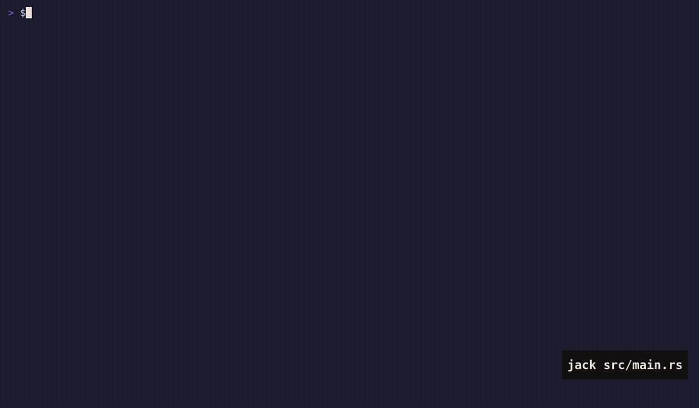
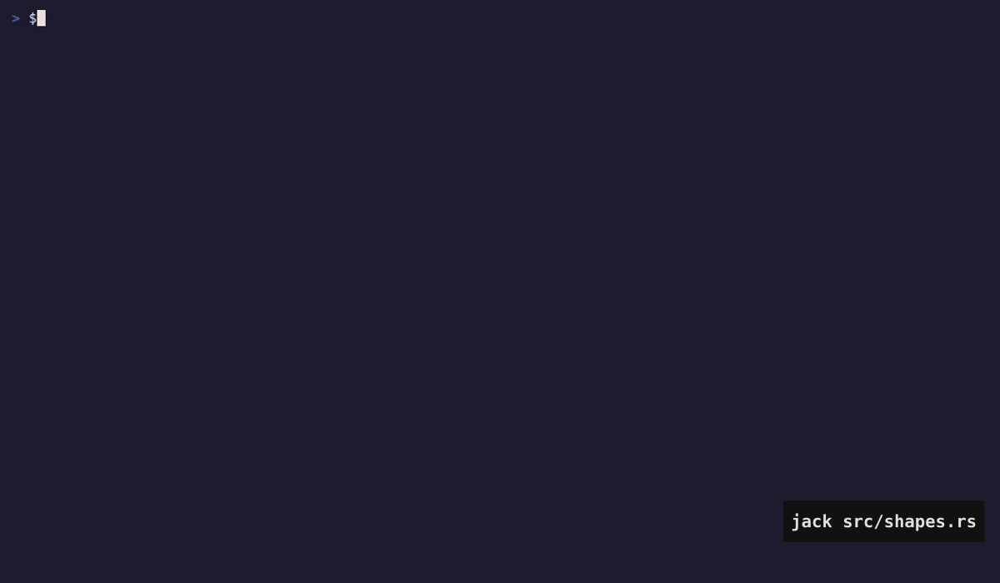
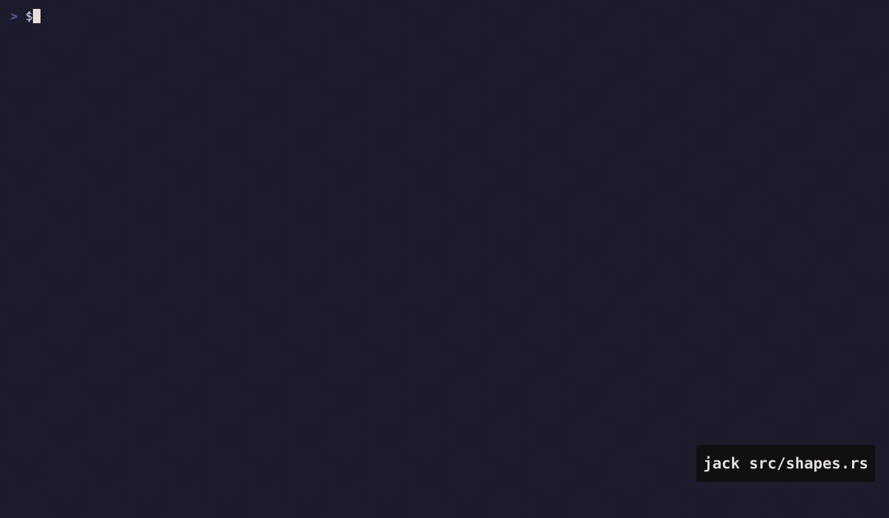
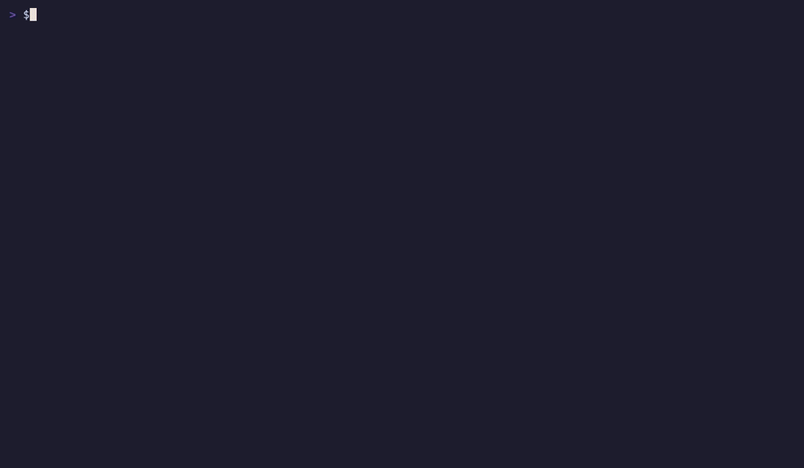
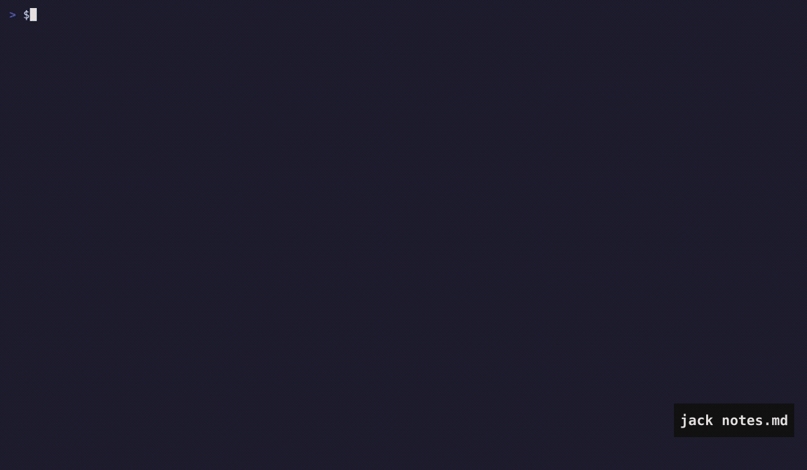
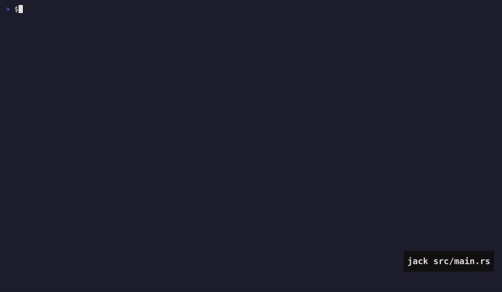
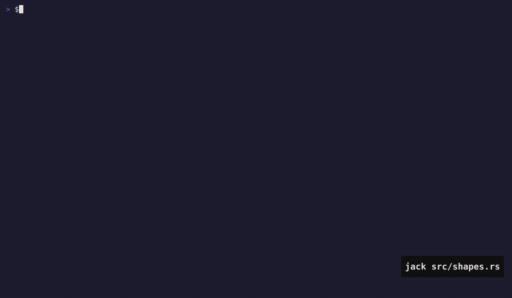
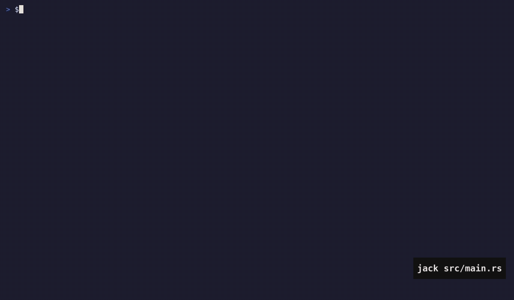
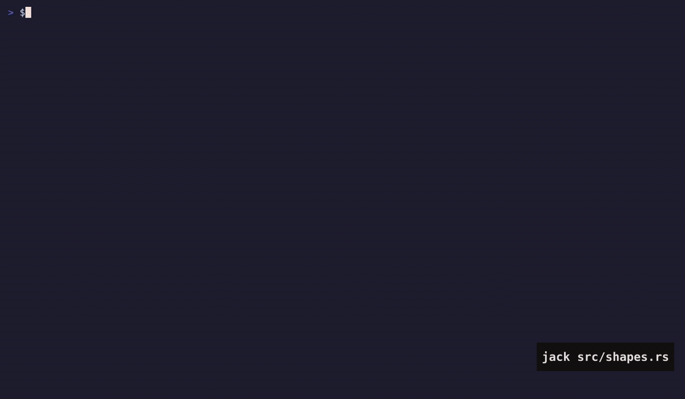

# The demos

Sixteen recordings of jack doing what it does, and the scripts that make them.
Nothing here is captured by hand: each GIF is a [vhs](https://github.com/charmbracelet/vhs)
tape — a list of keys and pauses — replayed into a headless terminal, so a
re-render after a change shows the change rather than a different take.

## Rendering them

```sh
sudo pacman -S vhs          # or: brew install vhs
cargo build --release
demo/render.sh              # all of them, into demo/gif/
demo/render.sh git lsp      # or just those two
demo/render.sh --no-keycast # without the keys named in the corner
```

Every take starts from its own throwaway copy of `demo/fixture` — a small Rust
crate, a Python file and a markdown file — made into a git repository with one
commit and one uncommitted edit on top of it, under a config directory of its
own. That is what makes the git demos have hunks to walk and the pickers have
something to find, without any of it depending on what is in your `~`.

The `terminal` take gets one extra edit: a semicolon taken out of
`shapes.rs`, so `:make` has a real error to put in the quickfix list. A
warning would not do — a cached `cargo check` replays nothing, and an empty
quickfix list demonstrates nothing.

`lsp.tape` and `tour.tape` want `rust-analyzer` on the path. The rest do not
want anything.

## The keys, named in the corner

Each clip says what is being pressed as it is pressed. Nothing captures the
keys: the tape already *is* the list of them, and vhs plays it back at a speed
the tape states, so `keycast.py` works the timing out — one typing-speed per
character of a `Type`, whatever a `Sleep` says, one typing-speed for a key —
and writes it as a subtitle that ffmpeg burns in.

Worked out is not the same as right, so it is checked rather than trusted:

```sh
demo/keycast.py demo/tapes/git.tape --check 25.0
# git            computed   25.4s  actual   25.0s  drift  +0.4s (+2%)
```

Every tape lands within one or two percent, always a little over, because vhs
runs a shade faster than the arithmetic says. The error is proportional rather
than accumulating, so `render.sh` passes `--actual` with the length that came
out and the timeline is scaled onto it. If a tape ever drifts further than
that, the model here has stopped matching what vhs does, and `--check` is how
you find out.

`space` and the key after it are one badge, `<space>f`, because that is one
thing pressed and it is how the keymap writes it.

## The tour

The one at the top of the main README.



## One thing at a time

| | |
|---|---|
| [`editing`](tapes/editing.tape) | motions, operators over them, `.`, counts, `^a` on a number, undo |
| [`cursors`](tapes/cursors.tape) | `^n` on the word under the cursor, `gm` a cursor per line |
| [`treesitter`](tapes/treesitter.tape) | folding from the grammar, `af` and `ac` as text objects, rainbow brackets |
| [`pickers`](tapes/pickers.tape) | `<space>f` files, `<space>s` live grep, `<space>d` definitions, `<space>l` lines, `<space>b` buffers |
| [`git`](tapes/git.tape) | the signs, `]c`, `<space>h`, `:stage`, `:revert`, blame, `<space>c` |
| [`lsp`](tapes/lsp.tape) | `K`, `gd`, `gr`, `gR`, inlay hints |
| [`terminal`](tapes/terminal.tape) | `:term`, `^\ ^n`, `<space>T`, `:make` and the quickfix list |
| [`commandline`](tapes/commandline.tape) | `:g`, `:%s`, `:sort`, completion on `tab`, `:hits` |
| [`surround`](tapes/surround.tape) | `ys` `cs` `ds`, `gc`, `=`, `gq` |
| [`windows`](tapes/windows.tape) | splits, `-` as a directory buffer, renaming by editing it |
| [`dog`](tapes/dog.tape) | the dog, and `:stats` |
| [`coach`](tapes/coach.tape) | `:set coach`, and the count you did not type |
| [`spotlight`](tapes/spotlight.tape) | `:set spotlight`, the function you are in lit and the rest dimmed |
| [`themes`](tapes/themes.tape) | `:themes`, three hundred and fifty schemes shown as you move over them |
| [`smear`](tapes/smear.tape) | `:set smear`, the cells the cursor crossed, for a moment |















## Writing another one

`tapes/_common.tape` holds the look — the size, the font, the theme, the
typing speed — and the two lines that put the shell in the throwaway fixture.
A new tape is that, an `Output`, and the keys:

```
Output demo/gif/mine.gif
Source demo/tapes/_common.tape

Type "$JACK src/main.rs" Enter
Sleep 2s
Type "zM" Sleep 1500ms
```

`$JACK` is the binary being demonstrated and `$DEMO` the fixture copy; both
come from `render.sh`. Keep a clip under twenty seconds and leave a beat after
each thing, because a GIF has no scrub bar and a reader gets one pass at it.

Three things that will cost you a take if you do not know them:

- **Two escapes after typing a word.** Typing pops the completion list up, and
  the first `esc` only closes it. One escape leaves you in insert mode, and
  every key after it goes into the file as text.
- **`^\ ^n` leaves `:term`, not `esc`.** Escape goes to the shell inside it.
- **`^n` selects.** After `^n` the word is a selection, so `c` changes it.
  `ciw` types `iw` into the buffer.

Check a take before believing it. `ffmpeg -i demo/gif/x.gif -vf
"select='not(mod(n\,100))'" -fps_mode passthrough /tmp/x%02d.png` pulls out
frames to look at, which is the only way to see that a key went astray.
